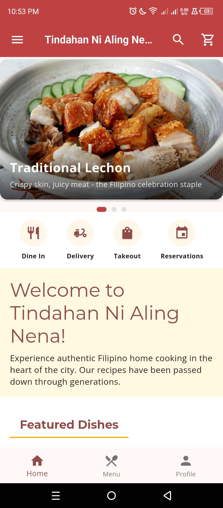
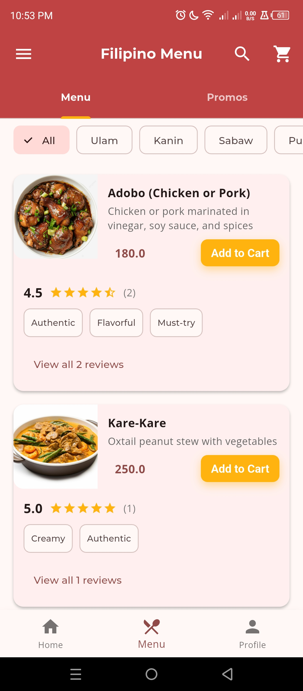
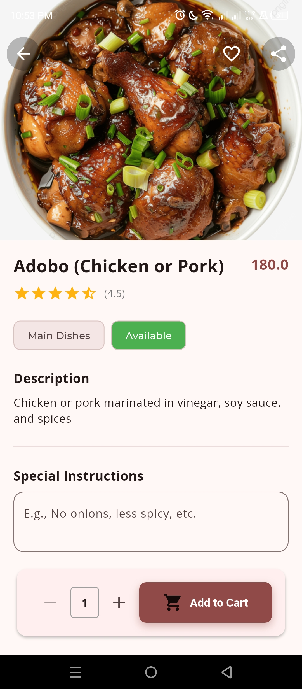
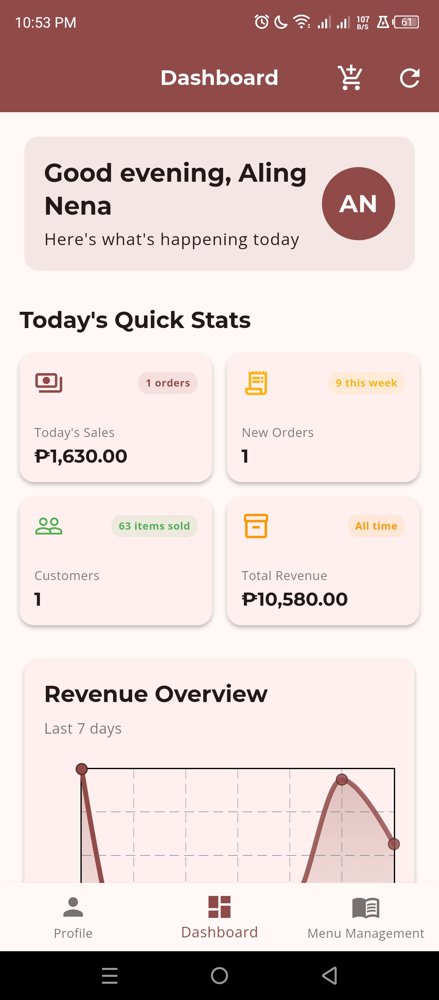
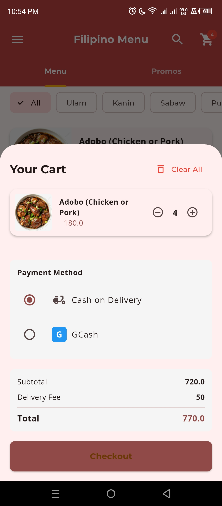
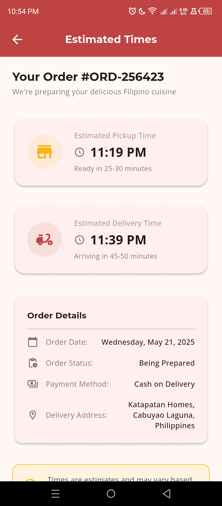

# Tindahan Ni Aling Nena - Restaurant Management Application


## Overview
Tindahan Ni Aling Nena is a comprehensive restaurant management application built with Flutter. It provides both customer-facing features and administrative capabilities for managing a Filipino restaurant.

## Features

### Customer Experience
- **User Authentication**: Register as a customer or use guest mode
- **Menu Browsing**: Browse Filipino dishes by categories like Ulam (Main Dishes), Kanin (Rice), etc.
- **Ordering System**: Add items to cart, customize with special instructions
- **Order Tracking**: Track order status and estimated delivery times
- **User Profiles**: Save preferences, addresses, and order history
- **Reviews & Ratings**: Read and write reviews for dishes

### Administrative Features
- **Dashboard**: Overview of sales, orders, and customers
- **Order Management**: Process new orders, track in-progress orders, and view completed orders
- **Menu Management**: Add, edit, or remove menu items; update availability
- **Financial Reporting**: Track revenue and sales analytics
- **Settings**: Configure restaurant information, hours, and other preferences

## Screenshots

<table>
  <tr>
    <td></td>
    <td></td>
    <td></td>
  </tr>
  <tr>
    <td></td>
    <td></td>
    <td></td>
  </tr>
</table>

## Installation

### Prerequisites
- Flutter SDK (version 3.7.2 or higher)
- Dart SDK
- Android Studio / VS Code with Flutter plugins
- Git

### Setup Instructions

1. Clone the repository:
```bash
git clone https://github.com/aarhonsaludar/tindahannialingnena
```

2. Navigate to the project directory:
```bash
cd tindahan
```

3. Get dependencies:
```bash
flutter pub get
```

4. Run the application:
```bash
flutter run
```

## Project Structure

- **lib/**: Contains all Dart code for the application
  - **main.dart**: Application entry point
  - **models/**: Data models (User, Cart, Order, etc.)
  - **pages/**: UI screens
  - **services/**: Business logic and data management
  - **themes/**: Design system and theming
  - **utils/**: Helper functions and utilities
  - **widgets/**: Reusable UI components
  - **validators/**: Input validation rules
- **assets**: Images and other static resources

## User Guide

### Customer View

#### Login/Registration:
- Use the login screen to sign in as a registered user
- Create a new account through the registration page
- Or continue as a guest

#### Browsing the Menu:
- Navigate through categories (Ulam, Kanin, etc.)
- Search for specific dishes
- Filter by category or price

#### Placing an Order:
- Add items to cart
- Customize with special instructions
- Review order and checkout
- Track delivery status

### Admin View

#### Dashboard:
- View key metrics like daily revenue and order counts
- See recent orders and popular items

#### Order Management:
- Process new orders
- Update order status
- View order history

#### Menu Management:
- Add new menu items with descriptions and images
- Edit existing menu items
- Toggle item availability

## Demo Accounts

### Admin:
- Email: admin@tindahan.com
- Password: admin123

### Customer:
- Email: customer@example.com
- Password: customer123

## Development Notes

- **State Management**: Provider pattern
- **Authentication**: Mock user service (would integrate with backend in production)
- **Design System**: Filipino-themed color palette and styling
- **Navigation**: Drawer and bottom navigation bar for easy access to key features

## Troubleshooting

- If facing image loading issues, ensure all assets are correctly referenced in pubspec.yaml
- For authentication issues, check the demo credentials or use guest mode
- If the application crashes, check the Flutter console for error details

## Future Enhancements

- Integration with real payment gateways
- Push notifications for order updates
- Customer loyalty program
- Table reservation system
- Kitchen display system for orders

## Developer
- [Aguilan, John Christopher A.]

## License
This project is licensed under the MIT License - see the LICENSE file for details.

## VIBE CODING ASF